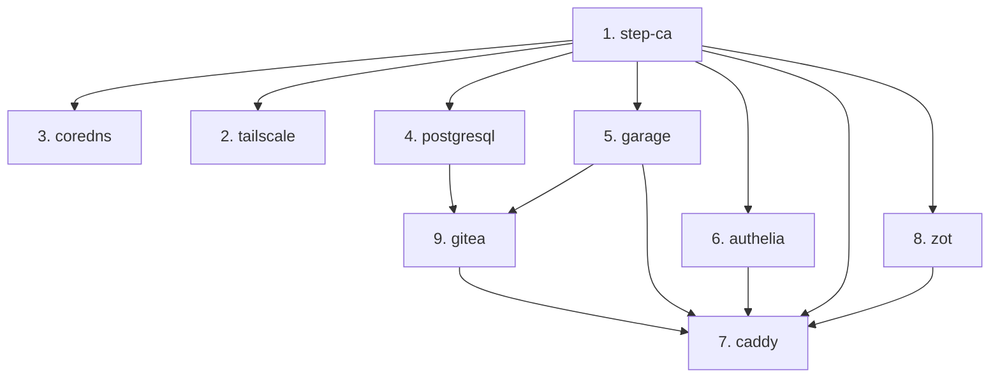

# Migracao de todos os stacks Packer para Terraform + Ansible

## Ordem de migracao (por dependencia)




**Importante:** O step-ca e o coredns sao a base de toda a infra. A migracao deles requer cuidado extra porque outros containers dependem de DNS e certificados. O tailscale e especial porque usa device nodes (`/dev/net/tun`) e nao usa step-ca agent.

## Padrao comum de cada migracao

Cada stack segue o mesmo padrao aplicado no Valkey:

1. **Ansible role** em `ansible/roles/<app>/` (tasks, handlers, defaults)
2. **Stack YAML** -- remover `packer:`, trocar import para `_terraform-lxc-v2.yaml`, usar `metadata.component: lxc-v2`
3. **Workflow YAML** -- remover step Packer, adicionar `configure` e `drift`
4. **DNS** -- adicionar registro A em `the-lab.zone` (para ACME)
5. **Inventario** -- adicionar host em `ansible/inventory/hosts.yml`
6. **Migracao operacional** -- backup, destroy, apply, configure, restore

---

## Plano 1: step-ca (CT 103, 10.40.1.3)

**Risco: ALTO** -- E a CA de toda a infra. Se ficar offline, nenhum container renova certificados.

### Role `ansible/roles/step-ca/`

Extrair de [stacks/catalog/packer/step-ca/playbook.yml](stacks/catalog/packer/step-ca/playbook.yml):

- Instalar step-cli e step-ca via .deb
- Criar user/group `step-ca`, diretorios
- Inicializar CA (`step ca init`) -- condicional (so se nao existir `ca.json`)
- Adicionar ACME provisioner -- condicional
- Criar systemd service `step-ca`
- Vars: `step_ca_password`, `step_ca_dns_name`
- **Nota:** o step-ca NAO usa a common role (ele e o proprio CA, nao precisa de step-renewer)

### Stack/Workflow

- Remover packer, usar `lxc-v2`, `template_url` Debian 13
- Workflows: `step-ca/apply`, `step-ca/configure`, `step-ca/drift`

### DNS

- `step-ca.infra` ja existe na zone file

### Migracao operacional

- **Backup critico:** `/var/lib/step-ca` contem as chaves da CA. Perder isso invalida TODOS os certificados emitidos
- Fazer backup, destroy, apply, configure, restaurar `/var/lib/step-ca`

---

## Plano 2: tailscale (CT 100, 10.40.0.10)

**Risco: MEDIO** -- E o acesso VPN. Se ficar offline, acesso remoto ao lab e perdido.

### Role `ansible/roles/tailscale/`

Extrair de [stacks/catalog/packer/tailscale/playbook.yml](stacks/catalog/packer/tailscale/playbook.yml):

- Adicionar repo Tailscale e instalar
- Configurar IP forwarding (sysctl)
- Iniciar `tailscaled` em userspace mode
- `tailscale up` com auth key, hostname, routes
- Vars: `ts_auth_key`, `ts_host`, `ts_routes`
- **Nota:** NAO usa common role (step-ca agent). Nao tem DNS proprio em `infra.the-lab.zone`

### Stack/Workflow

- Remover packer, usar `lxc-v2`
- Manter `extra_pve_conf_lines` para `/dev/net/tun`
- Workflows: `tailscale/apply`, `tailscale/configure`, `tailscale/drift`

### DNS

- Nao precisa de registro DNS (nao usa ACME)

---

## Plano 3: coredns (CT 102, 10.40.1.2)

**Risco: ALTO** -- E o DNS interno. Se ficar offline, step-renewer e outros servicos falham.

### Role `ansible/roles/coredns/`

Extrair de [stacks/catalog/packer/coredns/playbook.yml](stacks/catalog/packer/coredns/playbook.yml):

- Baixar binario CoreDNS
- Criar user/group `coredns`
- Criar systemd service com `CAP_NET_BIND_SERVICE`
- Copiar `Corefile` e `the-lab.zone`
- Vars: paths dos config files

### Stack/Workflow

- Remover packer, usar `lxc-v2`
- Manter `deploy-zone` workflow (util para atualizacoes de DNS sem reconfigurar tudo)
- Workflows: `coredns/apply`, `coredns/configure`, `coredns/drift`, `coredns/deploy-zone` (mantido)

### DNS

- Adicionar `coredns.infra IN A 10.40.1.2` (necessario se CoreDNS vai usar step-ca)
- **Nota circular:** CoreDNS precisa de DNS para ACME, mas ELE e o DNS. O container do CoreDNS pode usar seu proprio IP como DNS server, ou usar `1.1.1.1` e nao usar step-ca

---

## Plano 4: postgresql (CT 141, 10.40.1.41)

**Risco: ALTO** -- Banco de dados do Gitea. Perda de dados e critica.

### Role `ansible/roles/postgresql/`

Extrair de [stacks/catalog/packer/postgresql/playbook.yml](stacks/catalog/packer/postgresql/playbook.yml):

- Adicionar repo PGDG e instalar PostgreSQL
- Configurar `listen_addresses`, `pg_hba.conf`
- Migrar dados para mount point, criar symlink
- Configurar systemd overrides para permissoes
- Vars: `postgres_major_version`, `postgres_admin_password`
- Adaptacao Debian 13: verificar se PGDG suporta trixie

### Stack/Workflow

- Remover packer, usar `lxc-v2`
- Workflows: `postgresql/apply`, `postgresql/configure`, `postgresql/drift`

### DNS

- `postgres.infra` ja existe na zone file

### Migracao operacional

- **Backup critico:** `pg_dumpall` antes de destruir

---

## Plano 5: garage (CT 110, 10.40.1.10)

**Risco: ALTO** -- Storage S3 do Gitea.

### Role `ansible/roles/garage/`

Extrair de [stacks/catalog/packer/garage/playbook.yml](stacks/catalog/packer/garage/playbook.yml):

- Baixar binarios Garage e garage-webui
- Criar user/group `garage`
- Criar systemd services (`garage`, `garage-webui`)
- Copiar `garage.toml` (templated com secrets)
- Vars: `garage_rpc_secret`, `garage_admin_token`

### Stack/Workflow

- Remover packer, usar `lxc-v2`
- Workflows: `garage/apply`, `garage/configure`, `garage/drift`

### DNS

- Adicionar `garage.infra IN A 10.40.1.10`

### Migracao operacional

- Backup dos dados em `/var/lib/garage/data`

---

## Plano 6: authelia (CT 104, 10.40.1.4)

**Risco: MEDIO** -- Autenticacao. Se offline, acesso autenticado via Caddy falha.

### Role `ansible/roles/authelia/`

Extrair de [stacks/catalog/packer/authelia/playbook.yml](stacks/catalog/packer/authelia/playbook.yml):

- Adicionar repo Authelia e instalar
- Criar user/group `authelia`
- Criar systemd service
- Copiar config files (`configuration.yml`, `users_database.yml`)
- Vars: nenhuma extra var especifica (configs vem como files)

### Stack/Workflow

- Remover packer, usar `lxc-v2`
- Manter `deploy-config` workflow para updates de config com `op inject`
- Workflows: `authelia/apply`, `authelia/configure`, `authelia/drift`, `authelia/deploy-config` (mantido)

### DNS

- Adicionar `authelia.infra IN A 10.40.1.4`

---

## Plano 7: caddy (CT 121, 10.40.1.1)

**Risco: ALTO** -- Reverse proxy. Se offline, nenhum servico web e acessivel.

### Role `ansible/roles/caddy/`

Extrair de [stacks/catalog/packer/caddy/playbook.yml](stacks/catalog/packer/caddy/playbook.yml):

- Instalar Caddy do repo oficial
- Instalar Go e compilar custom Caddy com `xcaddy` (caddy-l4, caddy-dns/cloudflare)
- Substituir binario stock
- Copiar Caddyfile
- **Nota:** build do xcaddy pode ser lento; considerar pre-compilar ou usar uma versao sem plugins custom

### Stack/Workflow

- Remover packer, usar `lxc-v2`
- Manter `deploy-config` para Caddyfile
- Workflows: `caddy/apply`, `caddy/configure`, `caddy/drift`, `caddy/deploy-config` (mantido)

### DNS

- Adicionar `caddy.infra IN A 10.40.1.1`
- **Nota:** `caddy` e o `ingress` (10.40.1.1). Ja existe `ingress IN A 10.40.1.1`. Pode adicionar `caddy.infra` apontando para o mesmo IP

---

## Plano 8: zot (CT 130, 10.40.1.30)

**Risco: BAIXO** -- Registry OCI. Impacto limitado a deploys do Kubernetes.

### Role `ansible/roles/zot/`

Extrair de [stacks/catalog/packer/zot/playbook.yml](stacks/catalog/packer/zot/playbook.yml):

- Baixar binario Zot
- Criar user/group `zot`
- Gerar htpasswd
- Criar systemd service
- Copiar `config.json`
- Vars: `zot_username`, `zot_password`

### Stack/Workflow

- Remover packer, usar `lxc-v2`
- Workflows: `zot/apply`, `zot/configure`, `zot/drift`

### DNS

- Adicionar `zot.infra IN A 10.40.1.30`

---

## Plano 9: gitea (CT 120, 10.40.1.20)

**Risco: MEDIO** -- Depende de PostgreSQL e Garage ja migrados.

### Role `ansible/roles/gitea/`

Extrair de [stacks/catalog/packer/gitea/playbook.yml](stacks/catalog/packer/gitea/playbook.yml):

- Baixar binario Gitea
- Criar user/group `git`
- Criar systemd service
- Copiar `app.ini`
- Vars: nenhuma extra var (configs vem como file)

### Stack/Workflow

- Remover packer, usar `lxc-v2`
- Manter componentes Terraform `garage-bucket` e `postgresql-database` (nao mudam)
- Manter `deploy-config` para `app.ini`
- Workflows: `gitea/apply`, `gitea/configure`, `gitea/drift`, `gitea/deploy-config` (mantido)

### DNS

- Adicionar `gitea.infra IN A 10.40.1.20`

### Migracao operacional

- Backup de `/var/lib/gitea` (repos git)

---

## Resumo: registros DNS a adicionar na zone file

```
coredns.infra   IN A     10.40.1.2
authelia.infra  IN A     10.40.1.4
garage.infra    IN A     10.40.1.10
gitea.infra     IN A     10.40.1.20
zot.infra       IN A     10.40.1.30
caddy.infra     IN A     10.40.1.1
```

(`postgres.infra`, `valkey.infra`, `step-ca.infra` ja existem. `tailscale` nao precisa.)
