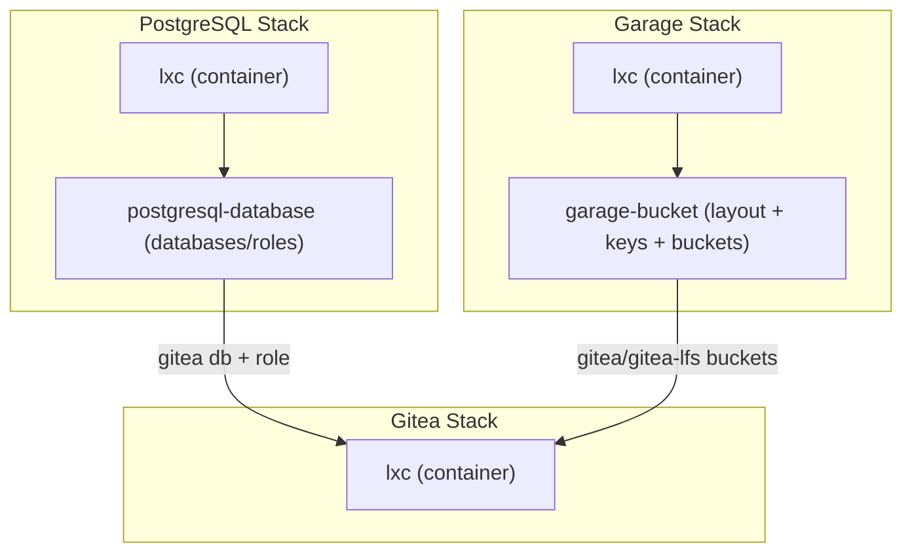

# Self-Contained PostgreSQL, Garage, and Gitea Migration

## Architecture




**Premise**: No backup/restore needed. Data loss is acceptable.

---

## 1. Refactor `postgresql-database` Terraform Component

**File**: [components/terraform/components/postgresql-database/](components/terraform/components/postgresql-database/)

**Current**: single `database_name` / `database_user` / `database_password` variables create one role + one database.

**New**: a `databases` map variable creates N roles + N databases.

- `**variables.tf**`: Remove `database_name`, `database_user`, `database_password`. Add:
  ```hcl
  variable "databases" {
    type = map(object({
      user     = string
      password = string
    }))
  }
  ```
- `**main.tf**`: Use `for_each = var.databases` on both `postgresql_role` and `postgresql_database`.
- `**output.tf**`: Replace scalar outputs with a `databases` map output containing `name`, `user`, `host`, `port` per entry.

---

## 2. Refactor `garage-bucket` Terraform Component

**File**: [components/terraform/components/garage-bucket/](components/terraform/components/garage-bucket/)

**Current**: single `key_name` + flat `bucket_names` list.

**New**: layout + multiple keys + multiple buckets with website flag.

- `**version.tf**`: Update provider version to `~> 1.1` (needed for `garage_cluster_layout`).
- `**variables.tf**`: Remove `key_name`, `bucket_names`. Add:
  ```hcl
  variable "nodes" {
    type = list(object({
      id       = string
      zone     = string
      capacity = string
      tags     = optional(list(string), [])
    }))
    default = []
  }

  variable "keys" {
    type = map(object({
      bucket_names = list(string)
    }))
  }

  variable "buckets" {
    type = map(object({
      website         = optional(bool, false)
      expiration_days = optional(number, 0)
    }))
  }
  ```
- `**main.tf**`:
  - Add `garage_cluster_layout` resource (conditional on `length(var.nodes) > 0`)
  - `garage_key` with `for_each = var.keys`
  - `garage_bucket` with `for_each = var.buckets`
  - `garage_bucket_key` with a flattened local that maps each key to its buckets
  - Website: the `arsolitt/garagehq` provider does NOT have a native `website` attribute on `garage_bucket`. Use a `null_resource` with `local-exec` calling the Garage Admin API (`PUT` to `/v2/PutBucketWebsite`) for buckets where `website = true`.
- `**output.tf**`: Map-based outputs for `keys` (access_key_id, secret_access_key per key) and `buckets` (id per bucket).

---

## 3. Update Ansible Garage Role (deploy `garage.toml`)

**File**: [ansible/roles/garage/tasks/main.yml](ansible/roles/garage/tasks/main.yml)

Currently the role installs binaries and systemd units but does NOT deploy `garage.toml`. Add:

- Move [stacks/catalog/lxc/garage/garage.toml](stacks/catalog/lxc/garage/garage.toml) to `ansible/roles/garage/templates/garage.toml.j2`, converting `{{ tpl_args.rpc_secret }}` / `{{ tpl_args.admin_token }}` to `{{ garage_rpc_secret }}` / `{{ garage_admin_token }}`.
- Add Ansible template task to deploy to `{{ garage_config_dir }}/garage.toml` with `notify: restart garage`.
- Update [workflows/garage.yaml](workflows/garage.yaml) `configure` step to pass `-e garage_rpc_secret=${GARAGE_RPC_SECRET} -e garage_admin_token=${GARAGE_ADMIN_TOKEN}`.

---

## 4. Update Stacks

### 4.1 `stacks/postgresql.yaml` -- add `postgresql-database` component

```yaml
postgresql-database:
  component: postgresql-database
  metadata:
    terraform_workspace: "{{ .stack }}-{{ .component }}"
  vars:
    postgresql_host: "10.40.1.41"
    postgresql_admin_password: !env POSTGRES_ADMIN_PASSWORD
    databases:
      gitea:
        user: gitea
        password: !env GITEA_DB_PASSWORD
```

### 4.2 `stacks/garage.yaml` -- add `garage-bucket` component

```yaml
garage-bucket:
  component: garage-bucket
  metadata:
    terraform_workspace: "{{ .stack }}-{{ .component }}"
  vars:
    garage_host: "10.40.1.10:3903"
    garage_admin_token: !env GARAGE_ADMIN_TOKEN
    nodes:
      - id: !env GARAGE_NODE_ID
        zone: "dc1"
        capacity: "100G"
    keys:
      gitea:
        bucket_names: ["gitea", "gitea-lfs"]
    buckets:
      gitea:
        website: false
      gitea-lfs:
        website: false
```

### 4.3 `stacks/gitea.yaml` -- simplify

Remove the `garage-bucket` and `postgresql-database` blocks entirely. Keep only the `lxc` component.

---

## 5. Update Workflows

### 5.1 `workflows/postgresql.yaml` -- add `provision`

```yaml
postgresql/provision:
  description: "Create databases and roles on the PostgreSQL server"
  steps:
    - command: terraform apply postgresql-database -s postgresql -auto-approve
```

### 5.2 `workflows/garage.yaml` -- add `provision`

```yaml
garage/provision:
  description: "Apply cluster layout and create buckets/keys"
  steps:
    - command: terraform apply garage-bucket -s garage -auto-approve
```

### 5.3 `workflows/gitea.yaml` -- simplify

- Remove `garage-bucket` and `postgresql-database` terraform apply steps from `gitea/apply`.
- Update `gitea/deploy-config` to use SSH (`scp`/`ssh`) instead of `pct push`.

---

## 6. Update `.env.tpl`

Add `GARAGE_NODE_ID` variable. The node ID is obtained from the running Garage instance via `ssh root@10.40.1.10 garage node id | cut -c1-64` after the first deployment.

---

## 7. Migration / Deploy Order

Since no backup is needed and data loss is acceptable:

1. Destroy old Gitea Terraform workspaces (`garage-bucket` and `postgresql-database` in the `gitea` stack) via HCP Terraform or `atmos terraform destroy`
2. Deploy **PostgreSQL**: `apply` -> `configure` -> `provision`
3. Deploy **Garage**: `apply` -> `configure` -> get node ID -> set `GARAGE_NODE_ID` env var -> `provision`
4. Deploy **Gitea**: `apply` -> `configure` -> `deploy-config`

